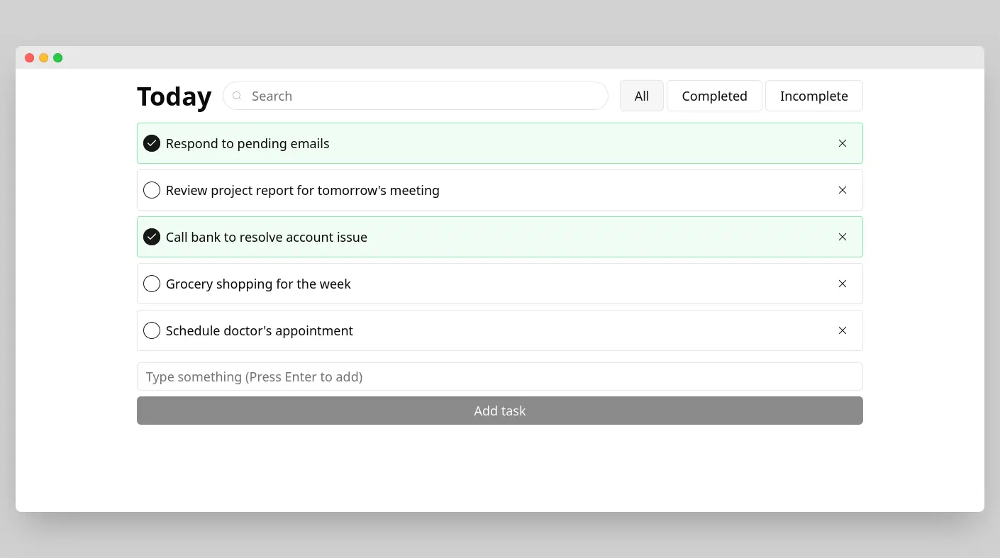
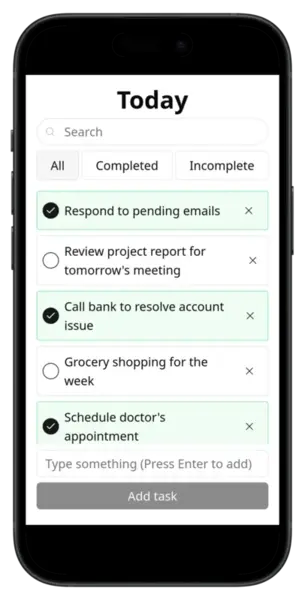

# Task Management

Basic task management application where users can: Add a task, Mark a task as complete, Delete a task, Filter tasks by "all", "completed," or "incomplete", Search tasks with a debounce feature

# Demo

[Visit](https://parthvyas7.github.io/tha-task-management/)

## Screenshots




## Run Locally

Clone project on your machine

Setup frontend

```sh
cd tha-task-management
npm install
```

Start the client
```sh
npm run dev
```

Visit client URI on browser

## License

[MIT](https://choosealicense.com/licenses/mit/)

